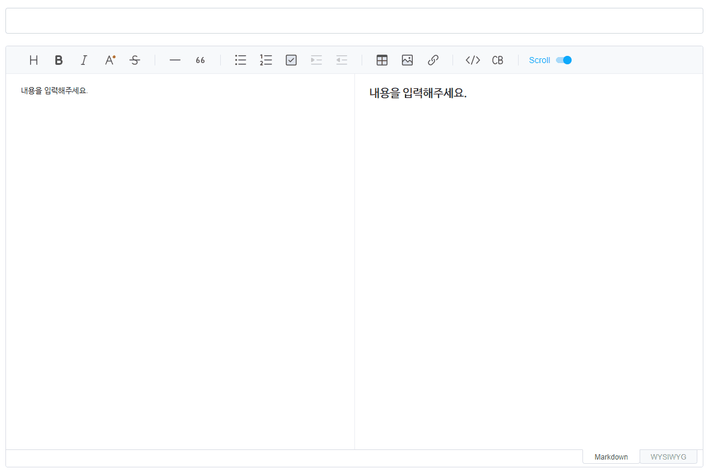
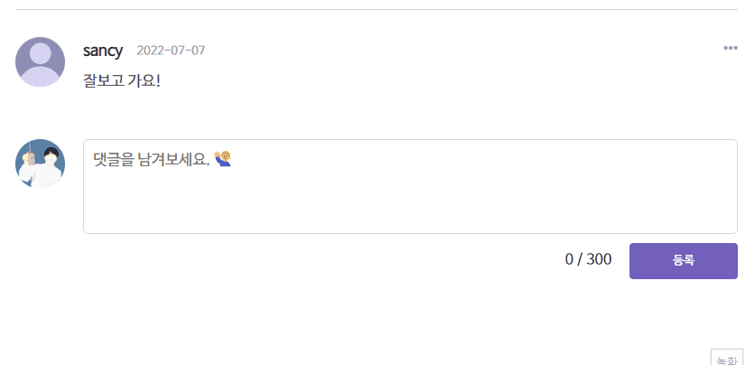

## 🥅 \***\*프로젝트 소개\*\***

개인 개발 기록, 공부한 내용 정리, 일상 공유 등의 목적으로 제작한 블로그, 갤러리 기능이 있는 웹 사이트에요.

 

## 🖥 프로젝트 미리보기

[블로그 방문하기 >](https://chanstory.dev)

<table>
  <tr>
    <td width="350px">
        
    </td>
    <td width="350px">
        
    </td>
  </tr>
  <tr>
    <td rowspan="1" align="center">
        <b>블로그 포스트</b>
    </td>
    <td rowspan="1" align="center">
        <b>블로그 포스트 등록</b>
    </td>
  </tr>
  <tr>
    <td width="350px">
        
    </td>
    <td width="350px">
        
    </td>
  </tr>
  <tr>
    <td rowspan="1" align="center">
        <b>갤러리 포스트 목록</b>
    </td>
    <td rowspan="1" align="center">
        <b>갤러리 포스트 </b>
    </td>
  </tr>
  <tr>
    <td width="350px">
        
    </td>
    <td width="350px">
        
    </td>
  </tr>
  <tr>
    <td rowspan="1" align="center">
        <b>갤러리 포스트 등록</b>
    </td>
    <td rowspan="1" align="center">
        <b>댓글과 답글</b>
    </td>
  </tr>
</table>

 

## ⌨ 작업 방식

- `Figma`를 활용해 PC, Mobile 화면을 디자인 한 뒤 반응형 웹 사이트를 구현했어요.
- `Git` 저장소, `DB`를 production 환경의 main브렌치와 develop 브렌치로 나누어 작업했어요.
- 프론트 단, 백 단 모두 `Next.js` 프레임워크를 사용해 구현했어요.

 

## ⚡ 기술 스택

- `Typescript` : 코드의 안정성을 높이고 자동완성 기능을 사용해 생산성을 높이기 위해 Typescript를 사용했어요.
- `React` : component 단위의 개발, 사용자의 사용성을 고려한 SPA 개발을 하기 위해 React를 사용했어요.
- `Next.js` : SSR, SSG를 사용하여 렌더링 성능 향상, SEO 최적화를 진행하고 serverless 환경에서 생산성 있게 프로젝트를 진행하기 위해 Next.js를 사용했어요.
- `Planetscale` : DB를 브렌치를 나누어 관리할 수 있고 개발자 경험이 좋은 planetscale을 사용했어요.
- `Prisma` : Typescript 환경에서 효율적인 DB 작업을 하기 위해 ORM으로 Prisma를 사용했어요.
- `SWR` : 데이터 요청 API를 효율적으로 사용하고 응답받은 데이터를 캐싱하여 관리하기 위해 SWR을 사용했어요.
- `vercel` : https를 기본으로 지원하고 자동화 배포를 지원하는 vercel을 사용했어요.

 

## 🌠 이슈

- 데이터 변화의 주기가 긴 블로그의 포스트 리스트들은 `SSG(Static Site Generation)`를 사용하여 정적 사이트로 생성해 로딩 없는 화면을 구현하고 서버 통신 비용을 줄였어요.
- 포스트 데이터를 `SSR(Server Side Rendering)`을 이용해 렌더링 전에 불러온 뒤 title, meta tag에 데이터를 입력하여 SEO 최적화 처리를 했어요.
- `tui-editor`를 활용하여 마크다운 형식의 포스팅이 가능하도록 하였으며 이미지 업로드 기능을 핸들링하여 포스트 내의 이미지가 `cloudflare`에 저장되도록 했어요.

 
